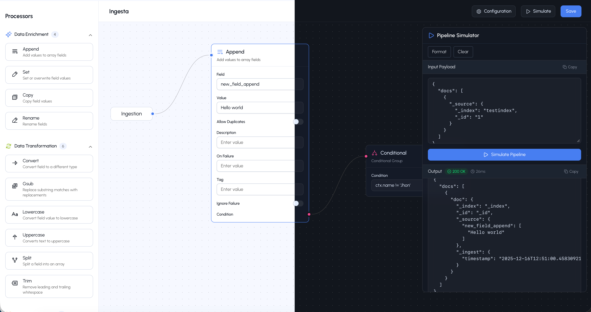

<div align="center">


<h1>Ingesta</>
</div>

A Svelte-based visual workflow builder for creating and managing OpenSearch ingest pipelines. Design complex data processing workflows with an intuitive node-based interface, configure conditional logic for processors, and simulate pipelines with real API calls to OpenSearch.



## Features

- **Visual Pipeline Designer**: Build ingest pipelines using an intuitive drag-and-drop workflow interface
- **Node Processors**: Create and configure processor nodes with custom conditional logic
- **Pipeline Simulation**: Test your pipelines with live API calls to OpenSearch
- **Real-time Validation**: Verify pipeline configurations before deployment
- **Test Management**: Store and manage test cases with payloads and results

## Getting Started

### Prerequisites

- Node.js (v24.11.1)
- npm, pnpm, or yarn
- OpenSearch instance (for testing and simulation)
- Docker (for local development)

### Installation

```sh
docker compose up
```

🔨 WORK IN PROGRESS

## 🚧 Development Roadmap

- ✅ Drag and Drop Node Processors
- ✅ Conditional Nodes
- ✅ Display pipeline configuration (JSON Mode)
- ✅ Pipeline Simulation
- 🚧 Failure Processors integration (In Progress)
- 🔨 Deploy to pipeline (Not Started)
- 🔨 Save tests (Not Started)
- 🪖 Pipeline Templates (logs, metrics, security, events) (Planning)
- 🪖 Bulk Import (Plannig)

## Processors Integration

| Processor Type | Integrated | 
| ------------- | ------------- |
| Append  | ✅ Completed |
| Bytes  | ✅ Completed |
| Convert | ✅ Completed |
| Copy | ✅ Completed |
| CSV | ✅ Completed |
| Date | ✅ Completed |
| Community ID | 🚨 Not Started|
| Date index name |🚨 Not Started|
| Dissect | 🚨 Not Started|
| Dot expander | 🚨 Not Started
| Drop | ✅ Completed
| Fail | ✅ Completed
| Fingerprint | ✅ Completed
| Foreach | 🚨 Not Started
| gsub | ✅ Completed
| IP2Geo | 🚨 Not Started
| Grok | ✅ Completed
| HTML strip | 🚨 Not Started
| Join | 🚨 Not Started
| JSON | ✅ Completed
| KV | 🚨 Not Started
| Lowercase | ✅ Completed
| ML inference | 🚨 Not Started
| Pipeline | 🚨 Not Started
| Remove | ✅ Completed
| Remove by pattern | 🚨 Not Started
| Rename | ✅ Completed |
| Script | 🚨 Not Started |
| Set | ✅ Completed |
| Sparse enconding | 🚨 Not Started
| Sort | 🚨 Not Started
| Text chunking | 🚨 Not Started
| Text embedding | 🚨 Not Started
| Split | ✅ Completed
| Text/image embedding | 🚨 Not Started
| Trim | ✅ Completed
| Uppercase | ✅ Completed
| URL Decode | 🚨 Not Started
| User agent | ✅ Completed
